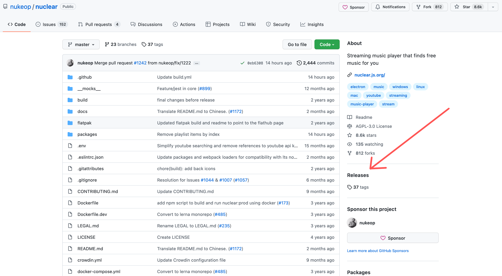

# FAQ

## Is there an Android/iOS version?

No. Apple's and Google's stores would **never** accept Nuclear in event the simplest possible form. Sideloading on both platforms is possible but hard for most people, and mobile phones are user-hostile platforms. \
\
While at some point we might release a mobile version with limited functionality, it's not a priority right now. I don't have a smartphone and I'm not planning to get one, so my familiarity with mobile programs and their usage patterns is poor.

## Which file do I download?

Every file contains the same version of Nuclear, there are no functional differences.

First, click "Releases":

You will see a list of releases. Find the most recent one (at the top), and click "Assets".

.png>)

You will see a list of files. You only need one of those files.

Here's which ones you should get on each platform, and what the differences between them are:

### **Windows:**

#### **nuclear.Setup.\<version>.exe**

This is an installer for Windows, which starts a standard installation wizard.

#### nuclear-v0.6.16.exe

This is a portable version, meaning the entire program is contained within a single file.

### Linux

#### Appimage

This a relatively new format that should run on most Linux distributions. It contains everything, including dependencies in a single file, and it allows the program to run in a portable way or be installed.

#### .deb

This is a package for Debian-based distros.

#### .rpm

This is a package for Red Hat/Fedora-based distros.

#### .snap

This is a universal package format that can run on most distros. In Ubuntu, this is becoming the standard format for many packages

#### **.tar.gz**

This is an archive containing compressed binary files and other assets. It should run on most distros.

### MacOS

On Mac, you should download the .dmg, .pkg, or .zip package. They should all work the same way.

